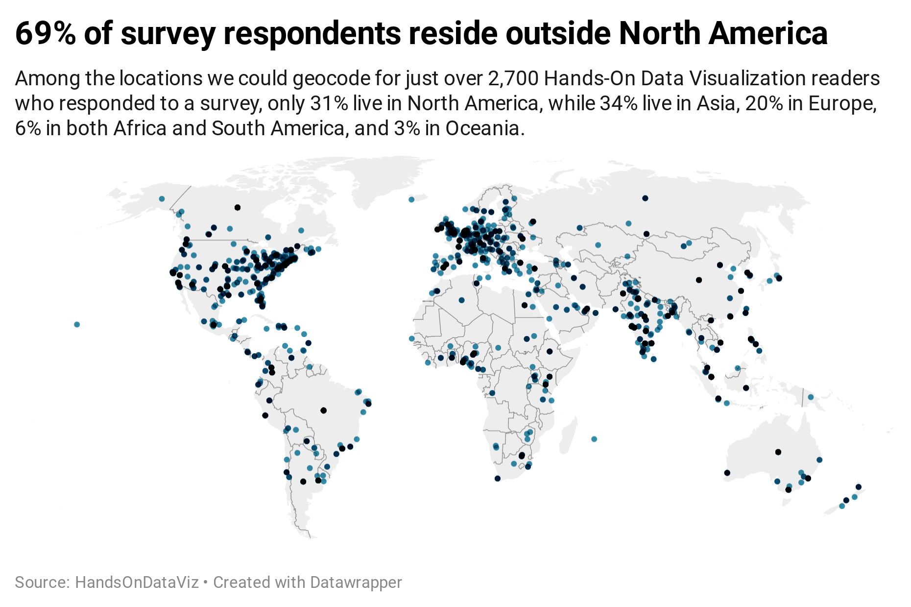
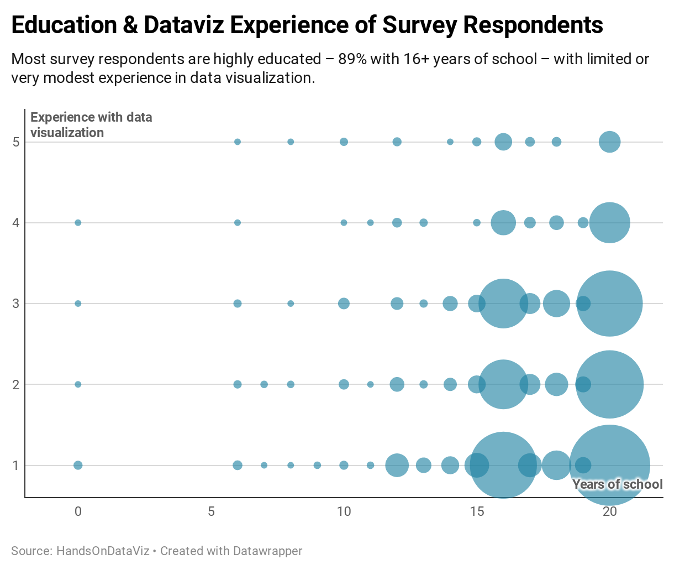

# survey-results
This repository contains a Jupyter notebook that performs processing of the HandsOnDataViz Survey Results so that data can be loaded to Datawrapper for visualization.

## Map
Full-screen map: https://datawrapper.dwcdn.net/vUvPl/1/

## Scatterplot
Full-screen chart: https://datawrapper.dwcdn.net/4vGwJ/1/

